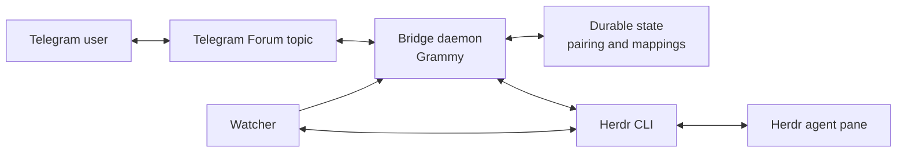
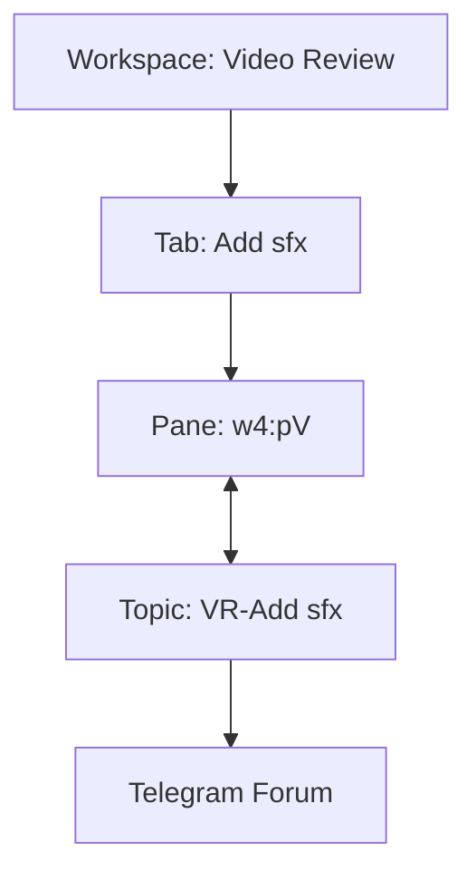
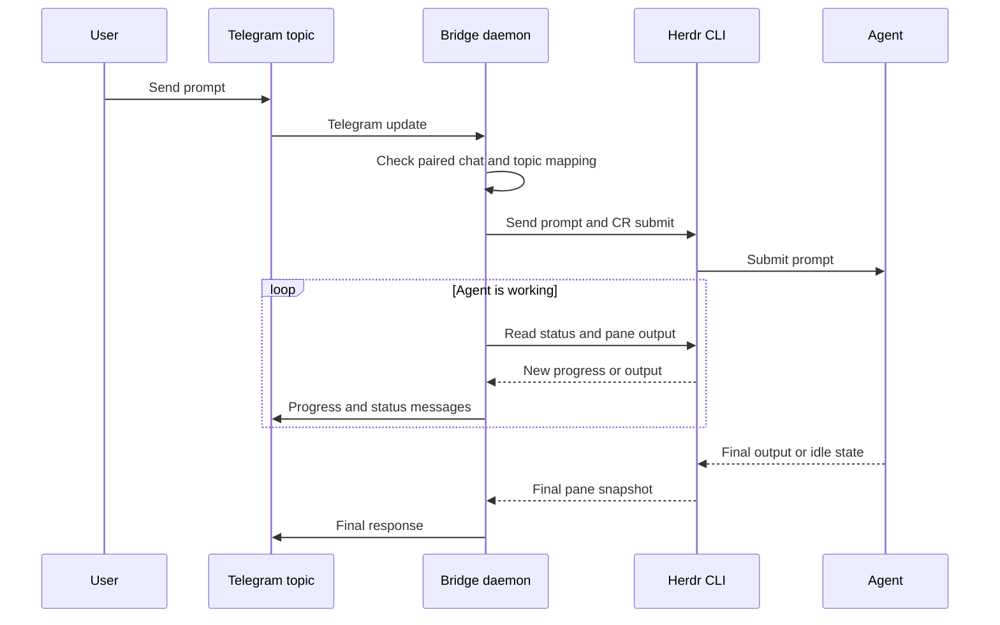
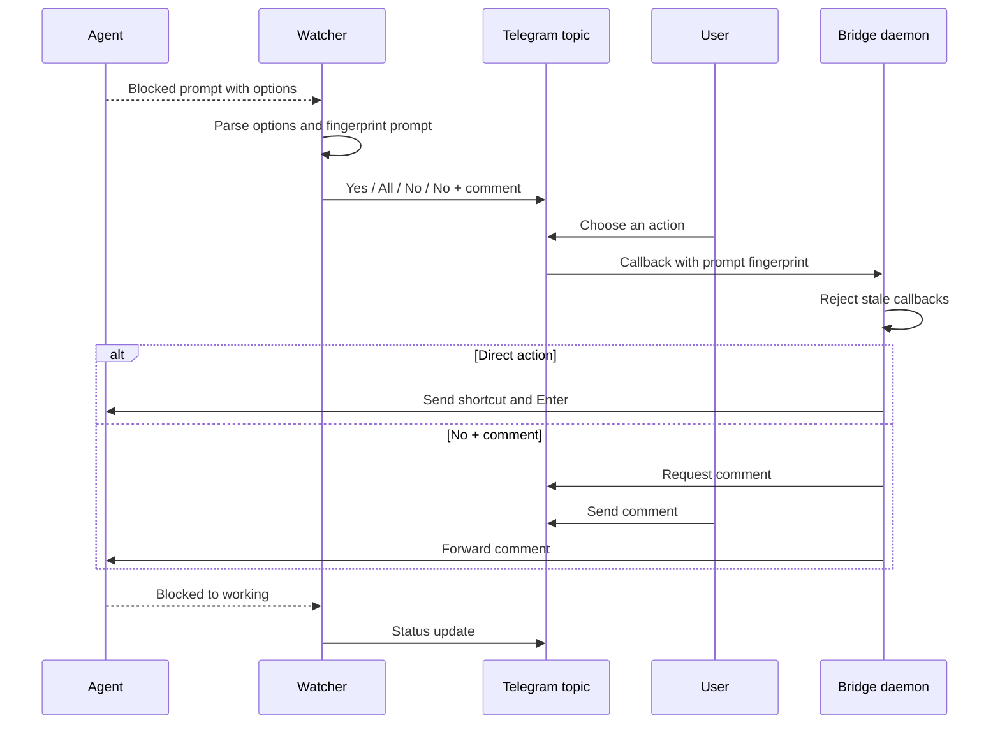
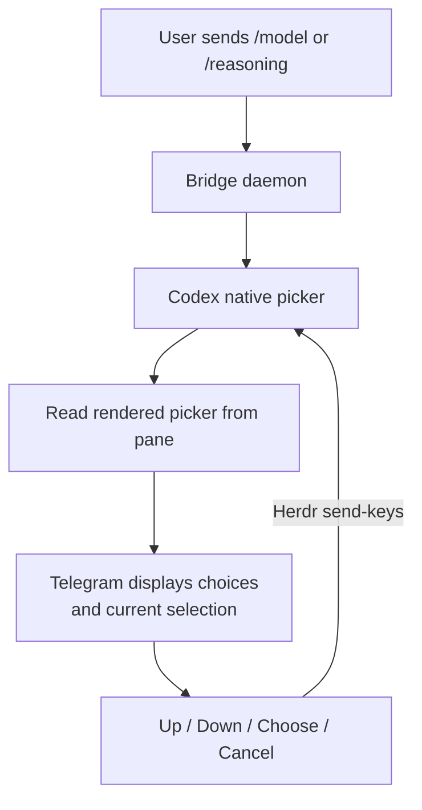

# herdr-telegram-plugin

Telegram Forum control plane for [herdr](https://herdr.dev). Each Herdr agent tab is represented by one Telegram forum topic. The bridge sends prompts, status, selected agent progress, approval controls, and final responses without placing an LLM between Telegram and the agent.

This repository is a maintained fork of [mvallebr/herdr-telegram-plugin](https://github.com/mvallebr/herdr-telegram-plugin). The fork adds two-way Codex-focused remote control, hardened authorization, and Windows validation.

## What Changed From Upstream

- Forum topics are named `[workspace abbreviation]-[tab name]`, for example `VR-Add sfx` for workspace `Video Review`.
- Plain text in a bound topic is submitted to the agent with the Codex carriage-return submit event, not merely inserted as a new composer line.
- The bridge relays useful agent progress bullets as separate Telegram messages while filtering shell/tool noise.
- Blocked permission and decision prompts become inline Telegram actions: Yes, All, No, and No + comment when the prompt supports it.
- Approval callbacks are fingerprinted. A button from an earlier prompt cannot approve a later prompt; stale keyboards are disabled when a new prompt arrives.
- `/model` and `/reasoning` open the native Codex picker and relay its rendered choices to Telegram, including the highlighted selection.
- Topic mappings survive temporary missing panes from Herdr. The bridge retains a topic as history instead of repeatedly deleting and recreating it.
- Commands, callbacks, and messages are restricted to the paired chat. State writes are atomic, outbound topic messages are serialized, and watcher ticks cannot overlap.
- The plugin supports Windows in CI and can run JavaScript Herdr mock binaries safely in tests.

## Requirements

- Herdr `>= 0.7.0`
- Node.js 20+
- A Telegram **Forum supergroup** with Topics enabled
- A bot created through BotFather and made an administrator of that group with **Manage Topics** permission

The bot pairs with exactly one Telegram chat. Do not pair it in a private chat: this bridge uses forum topics as its routing surface.

## Install

Install this fork with Herdr:

```bash
herdr plugin install tankisstank/herdr-telegram-plugin --yes
```

For development:

```bash
git clone https://github.com/tankisstank/herdr-telegram-plugin.git
cd herdr-telegram-plugin
npm ci
npm run build
herdr plugin link .
```

## Configure

Create `~/.config/herdr-telegram/config.toml` on Linux/macOS, or `%USERPROFILE%\.config\herdr-telegram\config.toml` on Windows:

```toml
[telegram]
bot_token = "YOUR_BOT_TOKEN"
progress_interval_ms = 15000

# Optional controls
# max_total_wait_s = 1800
# max_progress_updates = 60
# stability_window_ms = 30000
# follow_timeout_minutes = 30
```

Alternatively, provide the token with `HERDR_TG_BOT_TOKEN`. Do not commit the token or send it in chat logs.

## Start And Pair

Run the plugin bootstrap action, or start the daemon from the managed installation:

```bash
node dist/index.js --daemon
node dist/index.js --status
```

The daemon must be running to receive Telegram updates. Its state and PID are stored under `~/.local/state/herdr-telegram` (the same location is used on Windows under the user profile). Start it again after a reboot, or register the bootstrap action with your process supervisor or logon task.

Long-polling retries temporary Telegram failures, including a `409 Conflict` after a supervised restart. Use `node dist/index.js --status` to confirm that polling is running.

### Keep the daemon running on Windows

The Herdr event hook already restarts the daemon after the next
`pane.agent_status_changed` event if it is not running. For recovery after a
machine restart, a Herdr restart with no immediate agent event, or a daemon
crash while no agents are changing state, use Windows Task Scheduler under the
**same Windows account that runs Herdr**. Do not use `SYSTEM`: the bridge must
access that user's Herdr session and Telegram configuration.

Run the following once from an elevated or normal PowerShell session for that
user. It creates a logon task that retries a failed daemon every minute, plus a
watchdog that starts it again if it has stopped:

```powershell
$repo = "E:\\repo\\herdr-telegram-plugin"
$node = (Get-Command node.exe).Source
$user = "$env:USERDOMAIN\\$env:USERNAME"
$principal = New-ScheduledTaskPrincipal -UserId $user -LogonType Interactive -RunLevel Limited

$daemonAction = New-ScheduledTaskAction -Execute $node -Argument "`"$repo\\dist\\index.js`" --daemon" -WorkingDirectory $repo
$logonTrigger = New-ScheduledTaskTrigger -AtLogOn -User $user
$daemonSettings = New-ScheduledTaskSettingsSet -RestartCount 999 -RestartInterval (New-TimeSpan -Minutes 1) -MultipleInstances IgnoreNew -ExecutionTimeLimit (New-TimeSpan -Seconds 0)
Register-ScheduledTask -TaskName "Herdr Telegram Bridge" -Action $daemonAction -Trigger $logonTrigger -Settings $daemonSettings -Principal $principal -Force

$watchdogAction = New-ScheduledTaskAction -Execute "powershell.exe" -Argument "-NoProfile -ExecutionPolicy Bypass -File `"$repo\\scripts\\herdr-telegram-watchdog.ps1`"" -WorkingDirectory $repo
$watchdogTrigger = New-ScheduledTaskTrigger -Once -At (Get-Date).AddMinutes(1) -RepetitionInterval (New-TimeSpan -Minutes 3) -RepetitionDuration (New-TimeSpan -Days 9999)
$watchdogSettings = New-ScheduledTaskSettingsSet -MultipleInstances IgnoreNew -ExecutionTimeLimit (New-TimeSpan -Minutes 1)
Register-ScheduledTask -TaskName "Herdr Telegram Bridge Watchdog" -Action $watchdogAction -Trigger $watchdogTrigger -Settings $watchdogSettings -Principal $principal -Force
```

Verify the daemon and tasks:

```powershell
node dist/index.js --status
Get-ScheduledTask -TaskName "Herdr Telegram Bridge", "Herdr Telegram Bridge Watchdog"
```

To remove the automation later:

```powershell
Unregister-ScheduledTask -TaskName "Herdr Telegram Bridge", "Herdr Telegram Bridge Watchdog" -Confirm:$false
```

The bridge retains pairing and topic mappings across restarts. Active `/follow`
subscriptions are intentionally in-memory and must be started again after a
daemon restart.

Every outbound Telegram message is recorded before the Bot API call in `~/.local/state/herdr-telegram/telegram-messages.jsonl`. A matching `sent` or `failed` record follows with the same sequence number, making message order and delivery failures auditable. The active file rotates at 20 MB to `telegram-messages.jsonl.1`.

The audit file contains complete agent and user-facing message bodies. Treat it as sensitive local data and do not publish it without redaction.

In the target Telegram Forum supergroup, send `/pair`. The bot creates or reconciles one topic per current agent tab. From then on, only that paired chat can use the bot.

## Topic Workflow

1. Open the topic matching the desired Herdr tab, such as `VR-Add sfx`.
2. Send a plain text prompt. When the agent is idle, the bridge starts and observes a turn. When it is already working, the text is forwarded to the agent's queue.
3. Follow separate progress messages and status transitions in the same topic.
4. If the agent asks for an approval or decision, use the inline action buttons. Choose **No + comment** to send a free-text instruction with the rejection.

If a topic is not bound, the bot offers buttons to bind it to a current pane. Topics are retained when Herdr temporarily omits a tab, preventing accidental remapping during workspace changes or restarts.

## Architecture

### Control Plane



### Workspace, Tab, And Topic Mapping



### Prompt And Response Flow



### Approval And Comment Flow



### Model And Reasoning Picker



## Commands

| Command | Purpose |
| --- | --- |
| Plain text | Submit a prompt to the topic's agent pane. |
| `/pair` | Pair the current Forum supergroup. |
| `/unpair` | Remove pairing and delete bot-managed topics. |
| `/agents` | List detected agents and their status. |
| `/read [agent]` | Read output and offer a reply target. |
| `/reply [agent]` | Read an agent then send a reply. |
| `/send [agent] <text>` | Send text to a selected agent. |
| `/last` | Show the latest pane output without submitting a turn. |
| `/model` | Open the native Codex model picker and relay its choices. |
| `/reasoning` | Open the native picker and select Low, Medium, or High reasoning. |
| `/stop` | Send Escape to softly cancel the current operation. |
| `/submit` | Submit text already present in the topic agent's composer without typing it again. |
| `/interrupt` | Send Ctrl+C for a hard interrupt. |
| `/trust` | Send `trust, always allow` to the agent. |
| `/digest` | Ask the agent for a work summary. |
| `/follow [minutes]` | Continue relaying output after a turn; `0` means manual stop. |
| `/unfollow` | Stop the active follow subscription. |
| `/bind <label>` | Bind the current topic to a Herdr pane. |
| `/unbind` | Remove the current topic binding. |
| `/topics` | List bound topic IDs. |
| `/delete <id>` | Delete a bot-managed forum topic. |
| `/cleanup` | Remove duplicate topics. |
| `/reconcile` | Re-sync current Herdr tabs and Telegram topics. |
| `/status` | Show bridge uptime and follow status. |

## Model And Reasoning Selection

Run `/model` or `/reasoning` inside an **idle** Codex topic. Telegram shows the picker text from the agent TUI, so model names and the current `›` selection are visible remotely. Use **Up**, **Down**, **Choose**, or **Cancel** to operate the native picker. The available models remain account-specific because Codex itself supplies the picker.

## Reliability And Security

- All control messages are authorized against the paired chat before command or callback handling.
- Approval choices are bound to the exact prompt that created them.
- Approval dialogs are parsed from the newest anchored TUI prompt; uncertain prompts are reported without action buttons instead of guessing.
- A blocked agent never receives ordinary topic text; use its current approval controls instead.
- Telegram output for a topic is serialized to preserve progress, approval, and final-message order.
- Tool lifecycle bullets such as `Spawned`, `Waiting`, and `Closed` are suppressed; narrative progress remains separate and completed turns are emitted as a final message.
- Telegram message attempts and delivery results are retained as structured JSONL for presentation and ordering diagnostics.
- State files are written through a temporary file then renamed to avoid corruption on interruption.
- A normal observed turn stops on blocked state and has a configured hard timeout; it does not publish a false final response while an approval is waiting.

## Development

```bash
npm ci
npm test
npm run docs:build
```

The test suite includes watcher, approval, command, observe-loop, and mocked end-to-end turn-flow coverage. GitHub Actions runs tests on Ubuntu and Windows.

For a machine with a real Herdr installation and bot configuration, run the non-mutating operational preflight:

```bash
npm run smoke
```

## License

MIT. Original project: <https://github.com/mvallebr/herdr-telegram-plugin>.
